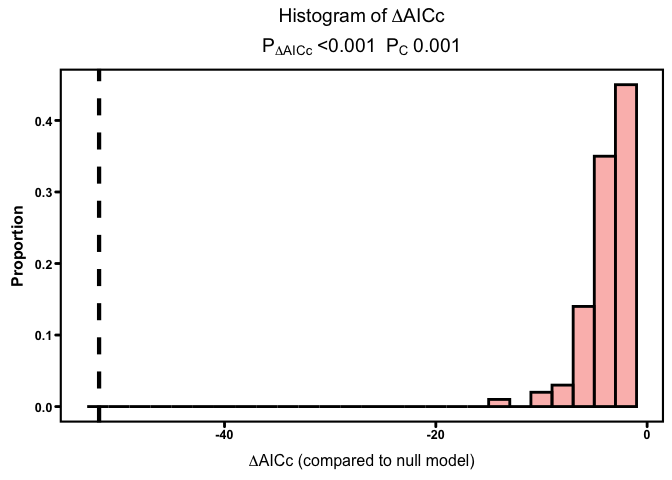

EpifaunaClimateSensitivity
================
LRA
4/11/2022

## Climate window analysis for epifauna

Here I am running a climate window analysis using the `climwin` package
for the wasting disease epifauna dataset. The goal is to test for
sensitivity of epifauna metrics to continuous climate variables
(e.g. mean temp, etc) over a moving window. This can better identify the
climate sensitivity, i.e. what climate variable over what time period is
the strongest predictor of epifuana community during the surveys.

### Epifauna and temperature data

I am using three years of epifauna data from the NSF wasting disease
surveys - 2019-2021. I am combining these with SST data from the MUR
product (1-km resolution). The MUR dataset has a long-term record,
allowing for the calculation of a long-term mean temperature and
anomalies from the long-term mean. The analysis of 2019 data showed that
wasting disease was related to temperature anomalies but not to absolute
temperatures. Here I am exploring the correlations between the epifauna
and temperature, i.e. a direct relationship that might have an indirect
effect on disease.

The drawback of using the MUR data is that there are not MUR data for
the Bodega region sites. In 2019, we could supplement with a different
SST data product (G1SST) but this product stopped being made as of Jan
1, 2020. There are other SST products available, one of which is VIIRS,
which has coverage of a different subset of sites than MUR. The two SST
products are not really comparable (VIIRS is warmer), so my plan is to
conduct multiple analyses, with VIIRS and with MUR sites separately and
compare the overlapping sites. Hopefully we will see the same trends
with temperature as we slice the datasets in different ways.

Note that the unit of replication here is transect. During the surveys,
we collected 2 epifauna samples per transect, at six transects per site.
This analysis combines those two transect-level replicates.

#### Missing data

We have no Alaska epifauna samples from 2020, no lower intertidal
epifauna samples from Oregon in 2020, and Bodega samples from 2021 are
not yet fully processed. So we have a partially limited dataset.
However, we have all the data we need to look at the MUR site
sensitivity.

### Response and predictor variables

Here, we are looking at the relationship between epifauna abundance
(response variable) and temperature (predictor). The specific
temperature predictors I am testing are:

-   the raw temperature (Temp)  
-   the temperature anomaly (deviation from the long-term mean,
    TempAnomaly)  
-   the warm temperature anomaly (positive deviations from the long-term
    mean, TempAnomalyHeat)

Note that the cumulative anomaly and mean anomaly over a given period of
time give the same relationship, just over a different scale. I used the
cumulative anomaly in the past, we can continue to do so or use the
mean.

I used the `climwin` package to systemically compare each of these three
metrics over periods of 0-6 months prior to sampling, using both the
site specific sampling date and the month of July as the sampling month.
The analysis also compares windows of different lengths (e.g. from 1-6
months in length).

The epifauna response variables I am testing are:

-   total epifauna abundance  
-   gastropod abundance
-   isopod abundance
-   lacuna abundance  
-   amphipod abundance  
-   ampithoid abundance

Units for all are per g wet weight of marcophytes.

We also have data on the species richness, I just need to check with
Emmett/Carmen about the best way to average species richness data. *Note
that we have other epifauna taxa, e.g. molluscs that we could also use*

Other predictors to include in the model are:  
- seagrass shoot density  
- seagrass blade area  
- tidal height (upper/lower)  
- year (fixed effect)  
- location (meadow aka site within region, random effect) *consider
whether location should be fixed?*

### Baseline models

The `climwin` analysis takes a baseline model, adds a temperature
metric, then assess whether the model with the temperature metric is
improved compared to the baseline model.

For each epifauna response variable, the baseline model is:

where Region and Meadow are random effects

The temperature models take the same model and add a temperature metric:

Note that continuous predictors of shoot density and blade area are
centered and standardized so the model will converge.

## Epifauna Abundance

### Fit baseline model

Set up baseline model as a glmer with Gamma distribution (because
abundance is greater than 0).

    ## Generalized linear mixed model fit by maximum likelihood (Laplace
    ##   Approximation) [glmerMod]
    ##  Family: Gamma  ( log )
    ## Formula: EpiAbun ~ sDensityShootsMean + sBladeArea + TidalHeight + fYear +  
    ##     (1 | Region) + (1 | Meadow)
    ##    Data: dis_env
    ## 
    ##      AIC      BIC   logLik deviance df.resid 
    ##   3152.7   3186.4  -1567.3   3134.7      304 
    ## 
    ## Scaled residuals: 
    ##     Min      1Q  Median      3Q     Max 
    ## -1.0712 -0.6722 -0.2748  0.3669  4.9682 
    ## 
    ## Random effects:
    ##  Groups   Name        Variance Std.Dev.
    ##  Meadow   (Intercept) 0.4234   0.6507  
    ##  Region   (Intercept) 0.2431   0.4930  
    ##  Residual             0.8136   0.9020  
    ## Number of obs: 313, groups:  Meadow, 21; Region, 5
    ## 
    ## Fixed effects:
    ##                    Estimate Std. Error t value Pr(>|z|)    
    ## (Intercept)         4.59162    0.31223  14.706  < 2e-16 ***
    ## sDensityShootsMean  0.10027    0.07289   1.376 0.168927    
    ## sBladeArea          0.03135    0.10385   0.302 0.762714    
    ## TidalHeightU       -0.41413    0.10848  -3.818 0.000135 ***
    ## fYear2020          -0.68761    0.12706  -5.412 6.24e-08 ***
    ## fYear2021          -0.43967    0.11373  -3.866 0.000111 ***
    ## ---
    ## Signif. codes:  0 '***' 0.001 '**' 0.01 '*' 0.05 '.' 0.1 ' ' 1
    ## 
    ## Correlation of Fixed Effects:
    ##             (Intr) sDnsSM sBldAr TdlHgU fY2020
    ## sDnstyShtsM  0.014                            
    ## sBladeArea  -0.136  0.041                     
    ## TidalHeghtU -0.208 -0.113  0.477              
    ## fYear2020   -0.154 -0.058  0.163  0.021       
    ## fYear2021   -0.210  0.102  0.288  0.189  0.401

    ## Single term deletions
    ## 
    ## Model:
    ## EpiAbun ~ sDensityShootsMean + sBladeArea + TidalHeight + fYear + 
    ##     (1 | Region) + (1 | Meadow)
    ##                    npar    AIC
    ## <none>                  3152.7
    ## sDensityShootsMean    1 3152.7
    ## sBladeArea            1 3150.8
    ## TidalHeight           1 3165.0
    ## fYear                 2 3180.1

No improvement to the model from dropping terms, so keep as the
baseline.

### Compare climate windows

The table below shows the opening and closing of the temperature window
for the best model (by AIC) using each temperature metric (Temp, Temp
Anomaly, and TempAnomalyHeat) and using the two different start dates
(relative to sampling and relative to the first of July). The DeltaAICc
column shows the improvement compared to the baseline model with no
temperature predictor.

    ##   response         climate     type stat func DeltaAICc WindowOpen WindowClose
    ## 1  EpiAbun     TempAnomaly absolute mean  lin     -8.14          3           1
    ## 2  EpiAbun TempAnomalyHeat absolute mean  lin    -13.59          2           2
    ## 3  EpiAbun            Temp absolute mean  lin     -8.32          2           1
    ## 4  EpiAbun     TempAnomaly relative mean  lin     -9.38          3           2
    ## 5  EpiAbun TempAnomalyHeat relative mean  lin    -16.38          3           2
    ## 6  EpiAbun            Temp relative mean  lin     -9.14          2           2

Adding any temperature predictor improves the baseline model
substantially (AIC decreases by at least 8). Models using
TempAnomalyHeat have the best improvement. There’s no substantial
difference in calculating the anomaly relative to the sampling date or
relative to July 1. Therefore use the absolute window since it is
simpler to understand. The climate window of the best predictor opens 2
months prior to sampling and closes 2 months prior to sampling. This is
May temperatures (2 months prior to July).

<!-- -->

    ## Generalized linear mixed model fit by maximum likelihood (Laplace
    ##   Approximation) [glmerMod]
    ##  Family: Gamma  ( log )
    ## Formula: yvar ~ sDensityShootsMean + sBladeArea + TidalHeight + fYear +  
    ##     (1 | Region) + (1 | Meadow) + climate
    ##    Data: modeldat
    ## 
    ##      AIC      BIC   logLik deviance df.resid 
    ##   3138.9   3176.4  -1559.5   3118.9      303 
    ## 
    ## Scaled residuals: 
    ##     Min      1Q  Median      3Q     Max 
    ## -1.0943 -0.6460 -0.2937  0.3759  5.0943 
    ## 
    ## Random effects:
    ##  Groups   Name        Variance Std.Dev.
    ##  Meadow   (Intercept) 0.4131   0.6428  
    ##  Region   (Intercept) 0.1974   0.4443  
    ##  Residual             0.7886   0.8880  
    ## Number of obs: 313, groups:  Meadow, 21; Region, 5
    ## 
    ## Fixed effects:
    ##                    Estimate Std. Error t value Pr(>|z|)    
    ## (Intercept)         4.25270    0.30531  13.929  < 2e-16 ***
    ## sDensityShootsMean -0.01692    0.07097  -0.238  0.81151    
    ## sBladeArea          0.07881    0.10092   0.781  0.43484    
    ## TidalHeightU       -0.34411    0.10720  -3.210  0.00133 ** 
    ## fYear2020          -0.88237    0.13009  -6.783 1.18e-11 ***
    ## fYear2021          -0.19866    0.12636  -1.572  0.11589    
    ## climate             0.72311    0.18275   3.957 7.59e-05 ***
    ## ---
    ## Signif. codes:  0 '***' 0.001 '**' 0.01 '*' 0.05 '.' 0.1 ' ' 1
    ## 
    ## Correlation of Fixed Effects:
    ##             (Intr) sDnsSM sBldAr TdlHgU fY2020 fY2021
    ## sDnstyShtsM  0.118                                   
    ## sBladeArea  -0.161 -0.009                            
    ## TidalHeghtU -0.243 -0.183  0.481                     
    ## fYear2020   -0.049  0.113  0.089 -0.046              
    ## fYear2021   -0.307 -0.102  0.301  0.230  0.170       
    ## climate     -0.264 -0.379  0.108  0.145 -0.321  0.472

<!-- -->

The heat map shows the improvement of the model when including the
specific metric of TempAnomalyHeat relative to July 1 and varying the
timing of the window (opening and closing from 0 to 6 months before July
1). There are other windows that might have a similar deltaAIC, but
overall see support for using the May window.

Looking at the summary, climate has a significant effect on epifauna
abundance, with more epifauna associated with greater warm anomalies in
May.

The climate effect is positive - warmer temperatures/anomalies
associated with more epifauna.

### Assess models for overfitting

After identifying the best climate window predictor, need to use
randomizations to make sure the relationship is not due to chance.

<!-- -->
\#\# Gastropod abundance

### Fit baseline model

Use LME because GastAbun starts at zero

    ## Linear mixed model fit by REML ['lmerMod']
    ## Formula: GastAbun ~ sDensityShootsMean + sBladeArea + TidalHeight + fYear +  
    ##     (1 | Region) + (1 | Meadow)
    ##    Data: dis_env
    ## 
    ## REML criterion at convergence: 3185.3
    ## 
    ## Scaled residuals: 
    ##     Min      1Q  Median      3Q     Max 
    ## -3.8782 -0.3672 -0.1269  0.2209  8.9366 
    ## 
    ## Random effects:
    ##  Groups   Name        Variance Std.Dev.
    ##  Meadow   (Intercept) 1679.2   40.98   
    ##  Region   (Intercept)  187.5   13.69   
    ##  Residual             1412.8   37.59   
    ## Number of obs: 313, groups:  Meadow, 21; Region, 5
    ## 
    ## Fixed effects:
    ##                    Estimate Std. Error t value
    ## (Intercept)          39.051     11.871   3.290
    ## sDensityShootsMean    3.491      2.843   1.228
    ## sBladeArea           -3.347      4.412  -0.759
    ## TidalHeightU         -7.339      4.961  -1.479
    ## fYear2020           -19.202      5.801  -3.310
    ## fYear2021            -2.187      5.171  -0.423
    ## 
    ## Correlation of Fixed Effects:
    ##             (Intr) sDnsSM sBldAr TdlHgU fY2020
    ## sDnstyShtsM  0.009                            
    ## sBladeArea  -0.158  0.080                     
    ## TidalHeghtU -0.234 -0.143  0.473              
    ## fYear2020   -0.171  0.029  0.054 -0.035       
    ## fYear2021   -0.239  0.127  0.296  0.130  0.403

    ## Single term deletions
    ## 
    ## Model:
    ## GastAbun ~ sDensityShootsMean + sBladeArea + TidalHeight + fYear + 
    ##     (1 | Region) + (1 | Meadow)
    ##                    npar    AIC
    ## <none>                  3233.4
    ## sDensityShootsMean    1 3232.9
    ## sBladeArea            1 3232.0
    ## TidalHeight           1 3233.6
    ## fYear                 2 3241.5

No improvement from droping terms so keep the baseline model.

### Compare climate windows

Same table of climwin combos as for epifauna model. For gastropods, we
see the biggest improvement for TempAnomalyHeat during January-February
relative to July 1, and during \~February (5 months prior) using
site-specific sampling date. These predictors improve model the same
amount so use July 1 reference point for simplicity.

    ##   response         climate     type stat func DeltaAICc WindowOpen WindowClose
    ## 1 GastAbun     TempAnomaly absolute mean  lin    -16.37          6           5
    ## 2 GastAbun TempAnomalyHeat absolute mean  lin    -19.69          6           5
    ## 3 GastAbun            Temp absolute mean  lin     -6.31          1           1
    ## 4 GastAbun     TempAnomaly relative mean  lin    -13.13          6           5
    ## 5 GastAbun TempAnomalyHeat relative mean  lin    -20.52          5           5
    ## 6 GastAbun            Temp relative mean  lin     -4.81          5           4

<!-- -->

    ## Linear mixed model fit by REML ['lmerMod']
    ## Formula: yvar ~ sDensityShootsMean + sBladeArea + TidalHeight + fYear +  
    ##     (1 | Region) + (1 | Meadow) + climate
    ##    Data: modeldat
    ## 
    ## REML criterion at convergence: 3163.5
    ## 
    ## Scaled residuals: 
    ##     Min      1Q  Median      3Q     Max 
    ## -3.7412 -0.4105 -0.0963  0.2177  8.9213 
    ## 
    ## Random effects:
    ##  Groups   Name        Variance Std.Dev.
    ##  Meadow   (Intercept) 1722     41.49   
    ##  Region   (Intercept)  558     23.62   
    ##  Residual             1344     36.67   
    ## Number of obs: 313, groups:  Meadow, 21; Region, 5
    ## 
    ## Fixed effects:
    ##                      Estimate Std. Error t value
    ## (Intercept)          85.33675   19.48680   4.379
    ## sDensityShootsMean    5.22102    2.81572   1.854
    ## sBladeArea            0.02302    4.46954   0.005
    ## TidalHeightU         -7.26880    4.86406  -1.494
    ## fYear2020           -42.75278    8.52599  -5.014
    ## fYear2021           -43.95700   12.29108  -3.576
    ## climate            -116.33013   31.21085  -3.727
    ## 
    ## Correlation of Fixed Effects:
    ##             (Intr) sDnsSM sBldAr TdlHgU fY2020 fY2021
    ## sDnstyShtsM  0.108                                   
    ## sBladeArea   0.039  0.099                            
    ## TidalHeghtU -0.135 -0.144  0.472                     
    ## fYear2020   -0.553 -0.098 -0.117 -0.028              
    ## fYear2021   -0.650 -0.091 -0.068  0.047  0.791       
    ## climate     -0.649 -0.155 -0.206 -0.009  0.747  0.912

<!-- -->
Generally see a big effect of climate on gastropods and an effect of
year. Climate anomaly effect is negative - warmer anomalies associated
with fewer gastropods.

### Assess models for overfitting

<!-- -->
Not due to random chance

## Isopod abundance

### Fit baseline model

    ## Linear mixed model fit by REML ['lmerMod']
    ## Formula: IsoAbun ~ sDensityShootsMean + sBladeArea + TidalHeight + fYear +  
    ##     (1 | Region) + (1 | Meadow)
    ##    Data: dis_env
    ## 
    ## REML criterion at convergence: 1471.5
    ## 
    ## Scaled residuals: 
    ##     Min      1Q  Median      3Q     Max 
    ## -2.3611 -0.4516 -0.0434  0.2724  8.3087 
    ## 
    ## Random effects:
    ##  Groups   Name        Variance Std.Dev.
    ##  Meadow   (Intercept) 1.516    1.231   
    ##  Region   (Intercept) 3.869    1.967   
    ##  Residual             5.654    2.378   
    ## Number of obs: 313, groups:  Meadow, 21; Region, 5
    ## 
    ## Fixed effects:
    ##                    Estimate Std. Error t value
    ## (Intercept)          2.2652     0.9684   2.339
    ## sDensityShootsMean   0.8838     0.1769   4.996
    ## sBladeArea           1.5018     0.2654   5.659
    ## TidalHeightU        -0.9067     0.3096  -2.929
    ## fYear2020            0.4801     0.3672   1.307
    ## fYear2021            0.1113     0.3256   0.342
    ## 
    ## Correlation of Fixed Effects:
    ##             (Intr) sDnsSM sBldAr TdlHgU fY2020
    ## sDnstyShtsM  0.006                            
    ## sBladeArea  -0.116  0.108                     
    ## TidalHeghtU -0.178 -0.132  0.450              
    ## fYear2020   -0.135  0.030  0.056 -0.036       
    ## fYear2021   -0.183  0.132  0.286  0.119  0.404

    ## Single term deletions
    ## 
    ## Model:
    ## IsoAbun ~ sDensityShootsMean + sBladeArea + TidalHeight + fYear + 
    ##     (1 | Region) + (1 | Meadow)
    ##                    npar    AIC
    ## <none>                  1486.9
    ## sDensityShootsMean    1 1508.8
    ## sBladeArea            1 1514.9
    ## TidalHeight           1 1493.6
    ## fYear                 2 1484.7

### Compare climate windows

    ##   response         climate     type stat func DeltaAICc WindowOpen WindowClose
    ## 1  IsoAbun     TempAnomaly absolute mean  lin    -44.61          4           0
    ## 2  IsoAbun TempAnomalyHeat absolute mean  lin    -51.87          6           0
    ## 3  IsoAbun            Temp absolute mean  lin    -30.12          4           0
    ## 4  IsoAbun     TempAnomaly relative mean  lin    -46.07          6           0
    ## 5  IsoAbun TempAnomalyHeat relative mean  lin    -52.14          6           0
    ## 6  IsoAbun            Temp relative mean  lin    -16.55          0           0

Most improvement via AIC from TempAnomalyHeat starting 6 months prior to
sampling and ending the month of sampling. Equivalent to use absolute or
relative starting date.

<!-- -->

    ## Linear mixed model fit by REML ['lmerMod']
    ## Formula: yvar ~ sDensityShootsMean + sBladeArea + TidalHeight + fYear +  
    ##     (1 | Region) + (1 | Meadow) + climate
    ##    Data: modeldat
    ## 
    ## REML criterion at convergence: 1417.5
    ## 
    ## Scaled residuals: 
    ##     Min      1Q  Median      3Q     Max 
    ## -2.6969 -0.4095 -0.1211  0.2868  7.8679 
    ## 
    ## Random effects:
    ##  Groups   Name        Variance Std.Dev.
    ##  Meadow   (Intercept) 1.694    1.302   
    ##  Region   (Intercept) 2.941    1.715   
    ##  Residual             4.735    2.176   
    ## Number of obs: 313, groups:  Meadow, 21; Region, 5
    ## 
    ## Fixed effects:
    ##                    Estimate Std. Error t value
    ## (Intercept)         -1.7663     1.0150  -1.740
    ## sDensityShootsMean   0.5147     0.1693   3.040
    ## sBladeArea           1.3067     0.2483   5.263
    ## TidalHeightU        -0.7860     0.2849  -2.759
    ## fYear2020            2.0533     0.3958   5.187
    ## fYear2021            2.0527     0.3944   5.205
    ## climate              8.4188     1.1165   7.540
    ## 
    ## Correlation of Fixed Effects:
    ##             (Intr) sDnsSM sBldAr TdlHgU fY2020 fY2021
    ## sDnstyShtsM  0.150                                   
    ## sBladeArea  -0.046  0.124                            
    ## TidalHeghtU -0.183 -0.144  0.449                     
    ## fYear2020   -0.376 -0.122 -0.010 -0.002              
    ## fYear2021   -0.463 -0.086  0.147  0.126  0.605       
    ## climate     -0.523 -0.276 -0.109  0.052  0.528  0.654

<!-- -->
Big effects of climate and year on isopods, as well as seagrass effects.
Climate effect is positive - more warm anomalies associated with more
isopods.

### Assess models for overfitting

<!-- -->
Not due to chance.

## Lacuna abundance

### Fit baseline model

    ## Linear mixed model fit by REML ['lmerMod']
    ## Formula: LacAbun ~ sDensityShootsMean + sBladeArea + TidalHeight + fYear +  
    ##     (1 | Region) + (1 | Meadow)
    ##    Data: dis_env
    ## 
    ## REML criterion at convergence: 2917.1
    ## 
    ## Scaled residuals: 
    ##     Min      1Q  Median      3Q     Max 
    ## -2.8425 -0.4650 -0.0249  0.2577  5.0313 
    ## 
    ## Random effects:
    ##  Groups   Name        Variance Std.Dev.
    ##  Meadow   (Intercept) 419.6    20.48   
    ##  Region   (Intercept) 103.3    10.16   
    ##  Residual             607.1    24.64   
    ## Number of obs: 313, groups:  Meadow, 21; Region, 5
    ## 
    ## Fixed effects:
    ##                    Estimate Std. Error t value
    ## (Intercept)         25.7767     7.1187   3.621
    ## sDensityShootsMean  -0.2636     1.8530  -0.142
    ## sBladeArea          -3.4875     2.8182  -1.237
    ## TidalHeightU        -0.9287     3.2275  -0.288
    ## fYear2020          -21.9174     3.8014  -5.766
    ## fYear2021          -14.1774     3.3828  -4.191
    ## 
    ## Correlation of Fixed Effects:
    ##             (Intr) sDnsSM sBldAr TdlHgU fY2020
    ## sDnstyShtsM  0.009                            
    ## sBladeArea  -0.169  0.094                     
    ## TidalHeghtU -0.254 -0.137  0.460              
    ## fYear2020   -0.187  0.030  0.053 -0.036       
    ## fYear2021   -0.260  0.130  0.291  0.124  0.404

    ## Single term deletions
    ## 
    ## Model:
    ## LacAbun ~ sDensityShootsMean + sBladeArea + TidalHeight + fYear + 
    ##     (1 | Region) + (1 | Meadow)
    ##                    npar    AIC
    ## <none>                  2959.9
    ## sDensityShootsMean    1 2958.0
    ## sBladeArea            1 2959.4
    ## TidalHeight           1 2958.0
    ## fYear                 2 2991.8

### Compare climate windows

    ##   response         climate     type stat func DeltaAICc WindowOpen WindowClose
    ## 1  LacAbun     TempAnomaly absolute mean  lin    -26.63          2           1
    ## 2  LacAbun TempAnomalyHeat absolute mean  lin    -20.91          3           1
    ## 3  LacAbun            Temp absolute mean  lin    -16.73          2           1
    ## 4  LacAbun     TempAnomaly relative mean  lin    -21.81          3           1
    ## 5  LacAbun TempAnomalyHeat relative mean  lin    -20.46          3           2
    ## 6  LacAbun            Temp relative mean  lin     -7.09          4           4

Lacuna abundance best model uses climate window for TempAnomaly (not
TempAnomalyHeat), from May-June. TempAnomalyHeat also improves model but
not by as much.

<!-- -->

    ## Linear mixed model fit by REML ['lmerMod']
    ## Formula: yvar ~ sDensityShootsMean + sBladeArea + TidalHeight + fYear +  
    ##     (1 | Region) + (1 | Meadow) + climate
    ##    Data: modeldat
    ## 
    ## REML criterion at convergence: 2888.4
    ## 
    ## Scaled residuals: 
    ##     Min      1Q  Median      3Q     Max 
    ## -3.1396 -0.3961 -0.0873  0.2611  5.3836 
    ## 
    ## Random effects:
    ##  Groups   Name        Variance Std.Dev.
    ##  Meadow   (Intercept) 446.42   21.129  
    ##  Region   (Intercept)  84.43    9.188  
    ##  Residual             558.89   23.641  
    ## Number of obs: 313, groups:  Meadow, 21; Region, 5
    ## 
    ## Fixed effects:
    ##                    Estimate Std. Error t value
    ## (Intercept)         21.3272     6.9425   3.072
    ## sDensityShootsMean  -1.5959     1.7995  -0.887
    ## sBladeArea           0.1072     2.8111   0.038
    ## TidalHeightU         0.9121     3.1231   0.292
    ## fYear2020          -20.6796     3.6558  -5.657
    ## fYear2021           -9.1069     3.3980  -2.680
    ## climate             19.4076     3.8615   5.026
    ## 
    ## Correlation of Fixed Effects:
    ##             (Intr) sDnsSM sBldAr TdlHgU fY2020 fY2021
    ## sDnstyShtsM  0.028                                   
    ## sBladeArea  -0.195  0.051                            
    ## TidalHeghtU -0.264 -0.153  0.474                     
    ## fYear2020   -0.193  0.019  0.068 -0.028              
    ## fYear2021   -0.284  0.079  0.344  0.153  0.405       
    ## climate     -0.132 -0.145  0.251  0.115  0.068  0.294

<!-- -->
Climate effect is positive - greater positive anomalies associated with
more Lacuna.

### Assess models for overfitting

<!-- -->
Not due to chance

## Amphipod abundance

### Fit baseline model

    ## Linear mixed model fit by REML ['lmerMod']
    ## Formula: AmphiAbun ~ sDensityShootsMean + sBladeArea + TidalHeight + fYear +  
    ##     (1 | Region) + (1 | Meadow)
    ##    Data: dis_env
    ## 
    ## REML criterion at convergence: 3342.1
    ## 
    ## Scaled residuals: 
    ##     Min      1Q  Median      3Q     Max 
    ## -3.0421 -0.1562 -0.0183  0.1208  7.4298 
    ## 
    ## Random effects:
    ##  Groups   Name        Variance Std.Dev.
    ##  Meadow   (Intercept) 1013     31.83   
    ##  Region   (Intercept) 4736     68.82   
    ##  Residual             2426     49.26   
    ## Number of obs: 313, groups:  Meadow, 21; Region, 5
    ## 
    ## Fixed effects:
    ##                    Estimate Std. Error t value
    ## (Intercept)         44.8726    32.2275   1.392
    ## sDensityShootsMean  11.5720     3.7001   3.128
    ## sBladeArea           0.1549     5.7286   0.027
    ## TidalHeightU        -9.3221     6.4885  -1.437
    ## fYear2020            8.4125     7.6130   1.105
    ## fYear2021           -4.7471     6.7679  -0.701
    ## 
    ## Correlation of Fixed Effects:
    ##             (Intr) sDnsSM sBldAr TdlHgU fY2020
    ## sDnstyShtsM  0.006                            
    ## sBladeArea  -0.075  0.085                     
    ## TidalHeghtU -0.112 -0.141  0.470              
    ## fYear2020   -0.085  0.028  0.058 -0.033       
    ## fYear2021   -0.115  0.127  0.294  0.128  0.404

    ## Single term deletions
    ## 
    ## Model:
    ## AmphiAbun ~ sDensityShootsMean + sBladeArea + TidalHeight + fYear + 
    ##     (1 | Region) + (1 | Meadow)
    ##                    npar    AIC
    ## <none>                  3395.0
    ## sDensityShootsMean    1 3402.8
    ## sBladeArea            1 3393.0
    ## TidalHeight           1 3395.2
    ## fYear                 2 3393.9

### Compare climate windows

    ##    response         climate     type stat func DeltaAICc WindowOpen WindowClose
    ## 1 AmphiAbun     TempAnomaly absolute mean  lin    -10.29          4           1
    ## 2 AmphiAbun TempAnomalyHeat absolute mean  lin    -14.87          5           2
    ## 3 AmphiAbun            Temp absolute mean  lin    -16.04          4           1
    ## 4 AmphiAbun     TempAnomaly relative mean  lin     -9.56          6           2
    ## 5 AmphiAbun TempAnomalyHeat relative mean  lin    -15.33          3           2
    ## 6 AmphiAbun            Temp relative mean  lin    -15.68          6           6

Amphipod abundance is most sensitive to temperature from March-June.
Similar model improvement with TempAnomalyHeat from Feb-May and for
TempAnomalyHeat 3 months prior to sampling date.

<!-- -->

    ## Linear mixed model fit by REML ['lmerMod']
    ## Formula: yvar ~ sDensityShootsMean + sBladeArea + TidalHeight + fYear +  
    ##     (1 | Region) + (1 | Meadow) + climate
    ##    Data: modeldat
    ## 
    ## REML criterion at convergence: 3324
    ## 
    ## Scaled residuals: 
    ##     Min      1Q  Median      3Q     Max 
    ## -3.1100 -0.1709 -0.0221  0.1136  7.4662 
    ## 
    ## Random effects:
    ##  Groups   Name        Variance Std.Dev.
    ##  Meadow   (Intercept)  994.9   31.54   
    ##  Region   (Intercept)  355.0   18.84   
    ##  Residual             2389.7   48.88   
    ## Number of obs: 313, groups:  Meadow, 21; Region, 5
    ## 
    ## Fixed effects:
    ##                      Estimate Std. Error t value
    ## (Intercept)        -179.08965   44.10176  -4.061
    ## sDensityShootsMean   10.13912    3.65442   2.774
    ## sBladeArea            0.05983    5.43883   0.011
    ## TidalHeightU         -8.95137    6.35887  -1.408
    ## fYear2020            11.19776    7.55135   1.483
    ## fYear2021             3.78019    6.96061   0.543
    ## climate              20.05116    3.89873   5.143
    ## 
    ## Correlation of Fixed Effects:
    ##             (Intr) sDnsSM sBldAr TdlHgU fY2020 fY2021
    ## sDnstyShtsM  0.069                                   
    ## sBladeArea  -0.178  0.105                            
    ## TidalHeghtU -0.157 -0.134  0.449                     
    ## fYear2020   -0.122  0.026  0.059 -0.033              
    ## fYear2021   -0.343  0.109  0.306  0.133  0.406       
    ## climate     -0.959 -0.069  0.131  0.081  0.065  0.275

<!-- -->
Climate effect is positive - warmer temps associated with more
amphipods.

### Assess models for overfitting

<!-- -->
Not due to chance.

## Ampithoid abundance

### Fit baseline model

    ## Linear mixed model fit by REML ['lmerMod']
    ## Formula: AmpithAbun ~ sDensityShootsMean + sBladeArea + TidalHeight +  
    ##     fYear + (1 | Region) + (1 | Meadow)
    ##    Data: dis_env
    ## 
    ## REML criterion at convergence: 1921.3
    ## 
    ## Scaled residuals: 
    ##     Min      1Q  Median      3Q     Max 
    ## -2.7782 -0.2643 -0.0702  0.1174  6.7472 
    ## 
    ## Random effects:
    ##  Groups   Name        Variance Std.Dev.
    ##  Meadow   (Intercept)  2.197   1.482   
    ##  Region   (Intercept) 30.642   5.535   
    ##  Residual             25.303   5.030   
    ## Number of obs: 313, groups:  Meadow, 21; Region, 5
    ## 
    ## Fixed effects:
    ##                    Estimate Std. Error t value
    ## (Intercept)          3.6325     2.5700   1.413
    ## sDensityShootsMean   1.6992     0.3643   4.664
    ## sBladeArea           0.3237     0.5185   0.624
    ## TidalHeightU        -0.3352     0.6420  -0.522
    ## fYear2020            1.2251     0.7764   1.578
    ## fYear2021           -0.5958     0.6842  -0.871
    ## 
    ## Correlation of Fixed Effects:
    ##             (Intr) sDnsSM sBldAr TdlHgU fY2020
    ## sDnstyShtsM  0.002                            
    ## sBladeArea  -0.084  0.155                     
    ## TidalHeghtU -0.137 -0.115  0.416              
    ## fYear2020   -0.108  0.032  0.055 -0.039       
    ## fYear2021   -0.143  0.138  0.271  0.104  0.406

    ## Single term deletions
    ## 
    ## Model:
    ## AmpithAbun ~ sDensityShootsMean + sBladeArea + TidalHeight + 
    ##     fYear + (1 | Region) + (1 | Meadow)
    ##                    npar    AIC
    ## <none>                  1946.0
    ## sDensityShootsMean    1 1965.3
    ## sBladeArea            1 1944.3
    ## TidalHeight           1 1944.3
    ## fYear                 2 1947.3

### Compare climate windows

    ##     response         climate     type stat func DeltaAICc WindowOpen
    ## 1 AmpithAbun     TempAnomaly absolute mean  lin    -22.07          6
    ## 2 AmpithAbun TempAnomalyHeat absolute mean  lin    -26.31          6
    ## 3 AmpithAbun            Temp absolute mean  lin    -19.89          2
    ## 4 AmpithAbun     TempAnomaly relative mean  lin    -18.51          6
    ## 5 AmpithAbun TempAnomalyHeat relative mean  lin    -24.57          6
    ## 6 AmpithAbun            Temp relative mean  lin    -10.92          6
    ##   WindowClose
    ## 1           1
    ## 2           1
    ## 3           1
    ## 4           1
    ## 5           2
    ## 6           6

Best improvement using TempAnomalyHeat from Jan-June

<!-- -->

    ## Linear mixed model fit by REML ['lmerMod']
    ## Formula: yvar ~ sDensityShootsMean + sBladeArea + TidalHeight + fYear +  
    ##     (1 | Region) + (1 | Meadow) + climate
    ##    Data: modeldat
    ## 
    ## REML criterion at convergence: 1892.9
    ## 
    ## Scaled residuals: 
    ##     Min      1Q  Median      3Q     Max 
    ## -3.4625 -0.2669 -0.0902  0.1513  6.2033 
    ## 
    ## Random effects:
    ##  Groups   Name        Variance Std.Dev.
    ##  Meadow   (Intercept)  1.81    1.345   
    ##  Region   (Intercept) 27.04    5.200   
    ##  Residual             23.52    4.849   
    ## Number of obs: 313, groups:  Meadow, 21; Region, 5
    ## 
    ## Fixed effects:
    ##                    Estimate Std. Error t value
    ## (Intercept)        -1.94314    2.65411  -0.732
    ## sDensityShootsMean  1.31550    0.35801   3.674
    ## sBladeArea          0.44961    0.49491   0.908
    ## TidalHeightU       -0.06251    0.61948  -0.101
    ## fYear2020           3.04177    0.82919   3.668
    ## fYear2021           2.49319    0.89660   2.781
    ## climate            13.09933    2.58440   5.069
    ## 
    ## Correlation of Fixed Effects:
    ##             (Intr) sDnsSM sBldAr TdlHgU fY2020 fY2021
    ## sDnstyShtsM  0.088                                   
    ## sBladeArea  -0.095  0.148                            
    ## TidalHeghtU -0.161 -0.128  0.413                     
    ## fYear2020   -0.269 -0.062  0.068  0.001              
    ## fYear2021   -0.379 -0.043  0.226  0.131  0.562       
    ## climate     -0.414 -0.210  0.043  0.083  0.431  0.678

<!-- -->

Climate effect is positive - warmer anomalies associated with more
ampithoids

### Assess models for overfitting

Not due to chance.

## Conclusions

Based on this exploration, epifauna abundances are indeed sensitive to
temperature anomalies, and the effects are generally larger than
seagrass predictors (although that is not fully explored here). The
temperature anomalies that improve models the most for each epifauna
response variable are as follows:

1.  Epifauna abundance \~ TempAnomalyHeat in May, positive correlation  
2.  Gastropod abundance \~ TempAnomalyHeat in Jan-Feb, negative
    correlation  
3.  Isopod abundance \~ TempAnomalyHeat in Jan-July, positive
    correlation  
4.  Lacuna abundance \~ TempAnomaly in May-June, positive correlation  
5.  Amphipod abundance \~ Temperature in March-June, positive
    correlation  
6.  Ampithoid abundance \~ TempAnomalyHeat from Jan-June, positive
    correlation

Note that TempAnomalyHeat does consistently improve the model by
deltaAIC &gt;2. So we could adopt this metric more consistently to
compare models.
