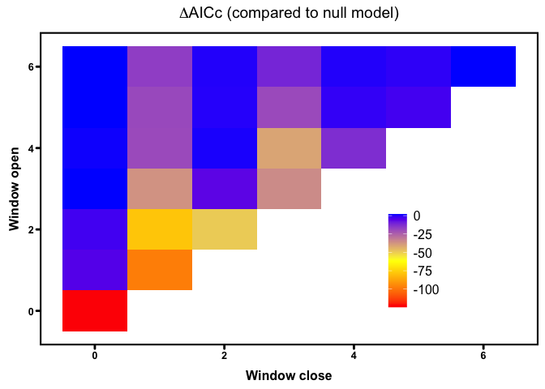
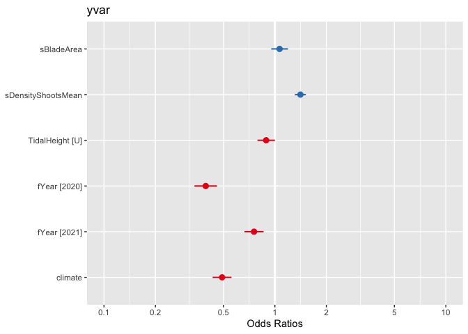
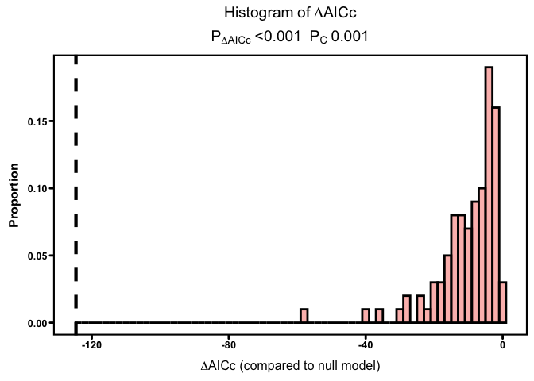
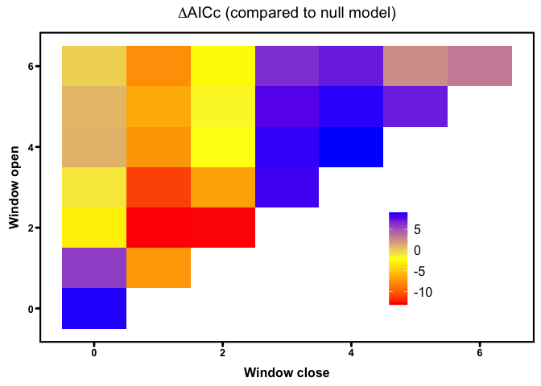
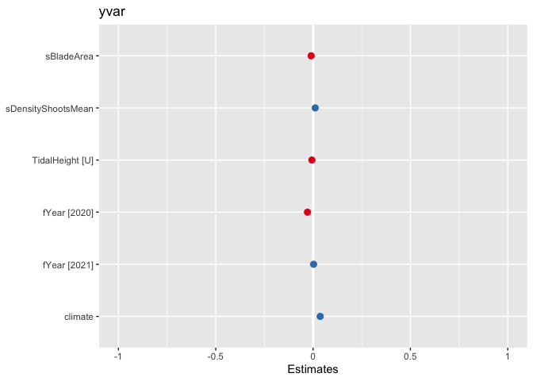
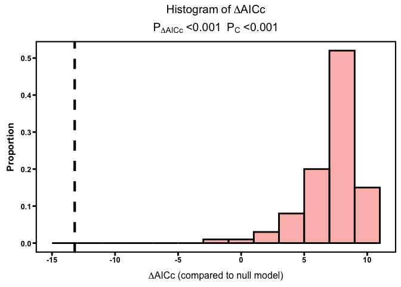
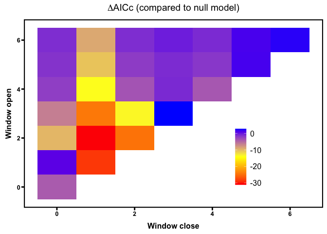
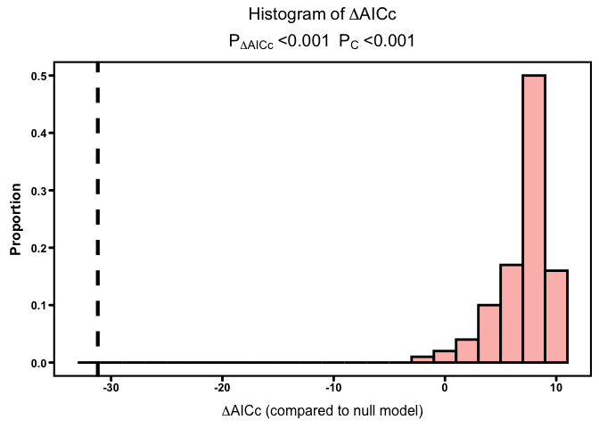

Climwin with MUR
================
LRA
1/27/2022

## Climate window analysis

Here I am running a climate window analysis using the `climwin` package
and following Maya’s protocol for the SJI disease data. The idea is to
test for sensitivity of wasting disease metrics to continuous climate
variables (e.g. mean temp, etc) over a moving window. This can better
identify the climate sensitivity.

### Disease and temperature data

I am using three years of disease data from the NSF wasting disease
surveys - 2019-2021. I am combining these with SST data from the MUR
product (1-km resolution). The MUR dataset has a long-term record,
allowing for the calculation of a long-term mean temperature and
anomalies from the long-term mean. The analysis of 2019 data showed that
disease was related to temperature anomalies but not to absolute
temperatures.

The drawback of using the MUR data is that there are not MUR data for
the Bodega region sites. In 2019, we could supplement with a different
SST data product (G1SST) but this product stopped being made as of Jan
1, 2020. I’m not really happy yet with other workarounds for Bodega
temperatures.

Note that the unit of replication here is transect, which is the level
at which we have shoot density data.

### Response and predictor variables

The response variables I am investigating are disease prevalence,
disease severity, and lesion area. For each response variable, I
conducted a sepearte climwin analysis using three different possible
climate predictors: 1) the absolute temperature (raw temperatures from
the MUR SST data), 2) the temperature anomaly (difference from the
long-term mean temperature), and 3) the warm temperature anomaly
(positive differences from the long-term mean temperature).

For each of the three climate predictors, I looked at relative climate
windows, measured prior to the day of sampling, and absolute climate
windows, prior to July 20, which is approximately the median sampling
date (July 18 in 2019, July 22 in 2020 and 2021). I looked at windows
starting up to 6 months prior to sampling and lasting from 1-6 months.
Over each climate window, I tested the mean temperature, mean
temperature anomaly, and mean warm temperature anomaly. I also tested
cumulative temperature metrics over the same windows, but note that
cumulative and mean metrics have the same effect on AIC. So for
simplicity I only did the full analysis with means.

The climate window analysis compares models with the climate predictor
to a baseline model without the climate predictor. I used a binomial
GLMM to model prevalence and a GLMM with a gamma distribution to model
severity and lesion area. The predictors for the baseline models were
`Blade Area`, `Shoot Density`, `Tidal Height` (upper or lower), and
`Year`. Region and Meadow are included as random effects (with Meadow
nested within Region)

### Baseline model for prevalence

For the prevalence analysis, the baseline model is a binomial GLMM that
has `Prevalence` as the response variable (0 or 1 for healthy or
diseased) and predictors of `Blade Area`, `Shoot Density`,
`Tidal Height` (upper or lower), and `Year`. These predictors were
significant in the 2019 data. Region and Meadow are included as random
effects (with Meadow nested within Region).

    ## Generalized linear mixed model fit by maximum likelihood (Laplace
    ##   Approximation) [glmerMod]
    ##  Family: binomial  ( logit )
    ## Formula: TransectPrevalence ~ sBladeArea + sDensityShootsMean + TidalHeight +  
    ##     fYear + (1 | Region) + (1 | Meadow)
    ##    Data: dis_env
    ## Weights: CountBlades
    ## 
    ##      AIC      BIC   logLik deviance df.resid 
    ##   2576.7   2607.9  -1280.4   2560.7      354 
    ## 
    ## Scaled residuals: 
    ##     Min      1Q  Median      3Q     Max 
    ## -4.4493 -1.4052 -0.2005  1.3158  5.7044 
    ## 
    ## Random effects:
    ##  Groups Name        Variance Std.Dev.
    ##  Meadow (Intercept) 0.3002   0.5479  
    ##  Region (Intercept) 0.4895   0.6996  
    ## Number of obs: 362, groups:  Meadow, 21; Region, 5
    ## 
    ## Fixed effects:
    ##                    Estimate Std. Error z value Pr(>|z|)    
    ## (Intercept)        -0.05800    0.34287  -0.169   0.8657    
    ## sBladeArea         -0.12635    0.05429  -2.327   0.0199 *  
    ## sDensityShootsMean  0.30905    0.03667   8.428  < 2e-16 ***
    ## TidalHeightU       -0.14494    0.05956  -2.434   0.0149 *  
    ## fYear2020          -0.45681    0.06331  -7.215 5.37e-13 ***
    ## fYear2021          -0.27790    0.06578  -4.224 2.39e-05 ***
    ## ---
    ## Signif. codes:  0 '***' 0.001 '**' 0.01 '*' 0.05 '.' 0.1 ' ' 1
    ## 
    ## Correlation of Fixed Effects:
    ##             (Intr) sBldAr sDnsSM TdlHgU fY2020
    ## sBladeArea  -0.077                            
    ## sDnstyShtsM -0.003  0.036                     
    ## TidalHeghtU -0.104  0.486 -0.130              
    ## fYear2020   -0.087  0.073  0.035  0.007       
    ## fYear2021   -0.106  0.328  0.094  0.152  0.466

    ## Single term deletions
    ## 
    ## Model:
    ## TransectPrevalence ~ sBladeArea + sDensityShootsMean + TidalHeight + 
    ##     fYear + (1 | Region) + (1 | Meadow)
    ##                    npar    AIC
    ## <none>                  2576.7
    ## sBladeArea            1 2580.2
    ## sDensityShootsMean    1 2646.2
    ## TidalHeight           1 2580.7
    ## fYear                 2 2626.1

In the baseline model, blade area, shoot density, and year are
significant predictors of prevalence and tidal height is not
significant. There’s no improvement in AIC by dropping terms from the
model, so we can keep this as the baseline model.

### Compare climate windows for prevalence

For the climate window analysis, I looked at three possible temperature
predictors: absolute temperature (raw values from the SST data), the
temperature anomaly (mean difference from long-term temperatures), the
monthly cumulative positive anomalies (i.e. the sum of positive
anomalies for each month) as the temperature predictor. I included
temperatures from the months 0-6 months prior to sampling

    ##              response         climate     type stat func DeltaAICc WindowOpen
    ## 1  TransectPrevalence     TempAnomaly absolute mean  lin    -56.79          2
    ## 2  TransectPrevalence TempAnomalyHeat absolute mean  lin    -32.86          2
    ## 3  TransectPrevalence            Temp absolute mean  lin    -46.93          0
    ## 4  TransectPrevalence     TempAnomaly relative mean  lin   -124.63          0
    ## 5  TransectPrevalence TempAnomalyHeat relative mean  lin    -73.47          0
    ## 6  TransectPrevalence            Temp relative mean  lin   -103.44          0
    ## 7  TransectPrevalence     TempAnomaly absolute  sum  lin    -56.79          2
    ## 8  TransectPrevalence TempAnomalyHeat absolute  sum  lin    -32.86          2
    ## 9  TransectPrevalence            Temp absolute  sum  lin    -46.93          0
    ## 10 TransectPrevalence     TempAnomaly relative  sum  lin   -124.63          0
    ## 11 TransectPrevalence TempAnomalyHeat relative  sum  lin    -73.47          0
    ## 12 TransectPrevalence            Temp relative  sum  lin   -103.44          0
    ##    WindowClose
    ## 1            1
    ## 2            2
    ## 3            0
    ## 4            0
    ## 5            0
    ## 6            0
    ## 7            1
    ## 8            2
    ## 9            0
    ## 10           0
    ## 11           0
    ## 12           0

<!-- -->

    ## Generalized linear mixed model fit by maximum likelihood (Laplace
    ##   Approximation) [glmerMod]
    ##  Family: binomial  ( logit )
    ## Formula: yvar ~ sBladeArea + sDensityShootsMean + TidalHeight + fYear +  
    ##     (1 | Region) + (1 | Meadow) + climate
    ##    Data: modeldat
    ## Weights: CountBlades
    ## 
    ##      AIC      BIC   logLik deviance df.resid 
    ##     2452     2487    -1217     2434      353 
    ## 
    ## Scaled residuals: 
    ##     Min      1Q  Median      3Q     Max 
    ## -4.5873 -1.3879 -0.1923  1.3644  5.8171 
    ## 
    ## Random effects:
    ##  Groups Name        Variance Std.Dev.
    ##  Meadow (Intercept) 0.3502   0.5918  
    ##  Region (Intercept) 0.2823   0.5313  
    ## Number of obs: 362, groups:  Meadow, 21; Region, 5
    ## 
    ## Fixed effects:
    ##                    Estimate Std. Error z value Pr(>|z|)    
    ## (Intercept)         0.31209    0.28218   1.106   0.2687    
    ## sBladeArea          0.06346    0.05744   1.105   0.2692    
    ## sDensityShootsMean  0.34358    0.03752   9.158  < 2e-16 ***
    ## TidalHeightU       -0.11758    0.05988  -1.963   0.0496 *  
    ## fYear2020          -0.93164    0.07753 -12.016  < 2e-16 ***
    ## fYear2021          -0.28108    0.06586  -4.268 1.98e-05 ***
    ## climate            -0.71147    0.06459 -11.015  < 2e-16 ***
    ## ---
    ## Signif. codes:  0 '***' 0.001 '**' 0.01 '*' 0.05 '.' 0.1 ' ' 1
    ## 
    ## Correlation of Fixed Effects:
    ##             (Intr) sBldAr sDnsSM TdlHgU fY2020 fY2021
    ## sBladeArea  -0.052                                   
    ## sDnstyShtsM  0.006  0.080                            
    ## TidalHeghtU -0.121  0.467 -0.120                     
    ## fYear2020   -0.152 -0.121 -0.043 -0.022              
    ## fYear2021   -0.130  0.301  0.101  0.144  0.381       
    ## climate     -0.116 -0.290 -0.101 -0.029  0.559 -0.011

<!-- -->

The most improved model has a climate predictor of temperature anomaly
for the month immediately before sampling (roughly mid-June to
mid-July). Other models do not have deltaAIC of similar magnitude.

Perhaps surprisingly, the coefficient of climate is negative, i.e. a
higher anomaly is related to lower prevalence. This is largely driven by
low disease prevalence in 2021, the year of the heat dome in some sites.
Prevalence may not be the most useful metric because of the bed
regression and loss of shoot densities over time.

### Assess prevalnce models for overfitting

After identifying the best climate window predictor, need to use
randomizations to make sure the relationship is not due to chance.  
<!-- -->

Radonmizations show the climate predictor’s signficance is not due to
chance. But the strong correlation between the climate predictor and
year might mean it’s hard to disentangle year effects and climate
effects.

### Baseline model for severity

The baseline model for severity is a linear model with predictors of
`Blade Area`, `Shoot Density`, `Tidal Height`, and `Year`. Note that
this is the initial model - for the full severity model, I will use a
zero-inflated GLMM with gamma distribution (a hurdle model), but the
outputs from the gamma model don’t run with the climwin package. However
this is exploratory analysis to identify relevant climate predictors, so
here I’m using the linear model.

    ## Linear mixed model fit by REML ['lmerMod']
    ## Formula: TransectSeverity ~ sBladeArea + sDensityShootsMean + TidalHeight +  
    ##     fYear + (1 | Region) + (1 | Meadow)
    ##    Data: dis_env
    ## 
    ## REML criterion at convergence: -1020.7
    ## 
    ## Scaled residuals: 
    ##     Min      1Q  Median      3Q     Max 
    ## -2.1247 -0.5327 -0.1254  0.2323  6.8759 
    ## 
    ## Random effects:
    ##  Groups   Name        Variance  Std.Dev.
    ##  Meadow   (Intercept) 0.0009166 0.03028 
    ##  Region   (Intercept) 0.0002432 0.01560 
    ##  Residual             0.0027387 0.05233 
    ## Number of obs: 362, groups:  Meadow, 21; Region, 5
    ## 
    ## Fixed effects:
    ##                     Estimate Std. Error t value
    ## (Intercept)         0.063866   0.011453   5.576
    ## sBladeArea         -0.013744   0.005247  -2.619
    ## sDensityShootsMean  0.014186   0.003606   3.934
    ## TidalHeightU       -0.007730   0.006223  -1.242
    ## fYear2020          -0.034667   0.006797  -5.100
    ## fYear2021          -0.012946   0.007008  -1.847
    ## 
    ## Correlation of Fixed Effects:
    ##             (Intr) sBldAr sDnsSM TdlHgU fY2020
    ## sBladeArea  -0.211                            
    ## sDnstyShtsM  0.000  0.130                     
    ## TidalHeghtU -0.309  0.425 -0.126              
    ## fYear2020   -0.283  0.074  0.085 -0.012       
    ## fYear2021   -0.326  0.273  0.132  0.099  0.483

    ## Single term deletions
    ## 
    ## Model:
    ## TransectSeverity ~ sBladeArea + sDensityShootsMean + TidalHeight + 
    ##     fYear + (1 | Region) + (1 | Meadow)
    ##                    npar     AIC
    ## <none>                  -1053.4
    ## sBladeArea            1 -1048.4
    ## sDensityShootsMean    1 -1041.0
    ## TidalHeight           1 -1053.9
    ## fYear                 2 -1031.6

No improvement to the model by dropping terms, therefore keep as
baseline

### Compare climate windows for severity

    ##           response         climate     type stat func DeltaAICc WindowOpen
    ## 1 TransectSeverity     TempAnomaly absolute mean  lin    -13.27          3
    ## 2 TransectSeverity TempAnomalyHeat absolute mean  lin    -11.28          3
    ## 3 TransectSeverity            Temp absolute mean  lin     -1.43          2
    ## 4 TransectSeverity     TempAnomaly relative mean  lin    -13.20          2
    ## 5 TransectSeverity TempAnomalyHeat relative mean  lin    -12.04          2
    ## 6 TransectSeverity            Temp relative mean  lin      8.64          2
    ##   WindowClose
    ## 1           1
    ## 2           1
    ## 3           1
    ## 4           1
    ## 5           2
    ## 6           2

<!-- -->

    ## Linear mixed model fit by REML ['lmerMod']
    ## Formula: yvar ~ sBladeArea + sDensityShootsMean + TidalHeight + fYear +  
    ##     (1 | Region) + (1 | Meadow) + climate
    ##    Data: modeldat
    ## 
    ## REML criterion at convergence: -1036
    ## 
    ## Scaled residuals: 
    ##     Min      1Q  Median      3Q     Max 
    ## -2.2032 -0.5218 -0.0906  0.3055  6.7106 
    ## 
    ## Random effects:
    ##  Groups   Name        Variance  Std.Dev.
    ##  Meadow   (Intercept) 0.0010098 0.03178 
    ##  Region   (Intercept) 0.0003799 0.01949 
    ##  Residual             0.0025466 0.05046 
    ## Number of obs: 362, groups:  Meadow, 21; Region, 5
    ## 
    ## Fixed effects:
    ##                     Estimate Std. Error t value
    ## (Intercept)         0.054359   0.012874   4.222
    ## sBladeArea         -0.009924   0.005262  -1.886
    ## sDensityShootsMean  0.010991   0.003567   3.081
    ## TidalHeightU       -0.006038   0.006059  -0.997
    ## fYear2020          -0.028651   0.006666  -4.298
    ## fYear2021           0.002785   0.007463   0.373
    ## climate             0.036632   0.007423   4.935
    ## 
    ## Correlation of Fixed Effects:
    ##             (Intr) sBldAr sDnsSM TdlHgU fY2020 fY2021
    ## sBladeArea  -0.207                                   
    ## sDnstyShtsM  0.033  0.081                            
    ## TidalHeghtU -0.278  0.442 -0.141                     
    ## fYear2020   -0.265  0.097  0.046 -0.001              
    ## fYear2021   -0.319  0.311  0.032  0.119  0.507       
    ## climate     -0.150  0.147 -0.197  0.059  0.182  0.421

<!-- -->

The best delatAIC is for temp anomaly based on 1 month relative window
starting 2 month prior to sampling (\~May) but equivalent deltaAICc for
temp anomaly based on absolute 2 month window opening 3 month prior to
July 1 (April-May)

Since lesion area is also related to \~May anomalies (see below), use
the May value?

# since \~May temp is the same for lesion area, use May?

### Assess severity models for overfitting

After identifying the best climate window predictor, need to use
randomizations to make sure the relationship is not due to chance.  
<!-- -->

Randomizations show the improved AIC is not due to chance

### Baseline model for lesion area

As with severity, this is a linear model for exploration. Predictors are
the same as for severity and prevalence (`Blade Area`, `Shoot Density`,
`Tidal Height`, and `Year`).

    ## Linear mixed model fit by REML ['lmerMod']
    ## Formula: TransectLesionArea ~ sBladeArea + sDensityShootsMean + TidalHeight +  
    ##     fYear + (1 | Region) + (1 | Meadow)
    ##    Data: dis_env
    ## 
    ## REML criterion at convergence: 1249.9
    ## 
    ## Scaled residuals: 
    ##     Min      1Q  Median      3Q     Max 
    ## -3.4510 -0.4180 -0.1264  0.2066  7.3133 
    ## 
    ## Random effects:
    ##  Groups   Name        Variance Std.Dev.
    ##  Meadow   (Intercept) 0.9524   0.9759  
    ##  Region   (Intercept) 0.2986   0.5464  
    ##  Residual             1.5637   1.2505  
    ## Number of obs: 362, groups:  Meadow, 21; Region, 5
    ## 
    ## Fixed effects:
    ##                    Estimate Std. Error t value
    ## (Intercept)         1.53752    0.36016   4.269
    ## sBladeArea         -0.23115    0.13339  -1.733
    ## sDensityShootsMean  0.07317    0.08729   0.838
    ## TidalHeightU       -0.29394    0.15133  -1.942
    ## fYear2020          -0.88419    0.16244  -5.443
    ## fYear2021          -0.52302    0.16817  -3.110
    ## 
    ## Correlation of Fixed Effects:
    ##             (Intr) sBldAr sDnsSM TdlHgU fY2020
    ## sBladeArea  -0.172                            
    ## sDnstyShtsM  0.006  0.094                     
    ## TidalHeghtU -0.243  0.455 -0.140              
    ## fYear2020   -0.215  0.072  0.085 -0.011       
    ## fYear2021   -0.252  0.284  0.126  0.112  0.481

    ## Single term deletions
    ## 
    ## Model:
    ## TransectLesionArea ~ sBladeArea + sDensityShootsMean + TidalHeight + 
    ##     fYear + (1 | Region) + (1 | Meadow)
    ##                    npar    AIC
    ## <none>                  1256.0
    ## sBladeArea            1 1256.8
    ## sDensityShootsMean    1 1254.6
    ## TidalHeight           1 1257.7
    ## fYear                 2 1281.1

No improvement to the model by dropping terms, therefore keep as
baseline

### Compare climate windows for lesion area

    ##   |                                                                              |                                                                      |   0%  |                                                                              |||                                                                    |   4%  |                                                                              |||||||||                                                              |  11%  |                                                                              ||||||||||||||||                                                       |  21%  |                                                                              ||||||||||||||||||||||||||                                             |  36%  |                                                                              |||||||||||||||||||||||||||||||||||||||                                |  54%  |                                                                              |||||||||||||||||||||||||||||||||||||||||||||||||||||                  |  75%  |                                                                              |||||||||||||||||||||||||||||||||||||||||||||||||||||||||||||||||||||||| 100%  |                                                                              |                                                                      |   0%  |                                                                              |||                                                                    |   4%  |                                                                              |||||||||                                                              |  11%  |                                                                              ||||||||||||||||                                                       |  21%  |                                                                              ||||||||||||||||||||||||||                                             |  36%  |                                                                              |||||||||||||||||||||||||||||||||||||||                                |  54%  |                                                                              |||||||||||||||||||||||||||||||||||||||||||||||||||||                  |  75%  |                                                                              |||||||||||||||||||||||||||||||||||||||||||||||||||||||||||||||||||||||| 100%  |                                                                              |                                                                      |   0%  |                                                                              |||                                                                    |   4%  |                                                                              |||||||||                                                              |  11%  |                                                                              ||||||||||||||||                                                       |  21%  |                                                                              ||||||||||||||||||||||||||                                             |  36%  |                                                                              |||||||||||||||||||||||||||||||||||||||                                |  54%  |                                                                              |||||||||||||||||||||||||||||||||||||||||||||||||||||                  |  75%  |                                                                              |||||||||||||||||||||||||||||||||||||||||||||||||||||||||||||||||||||||| 100%  |                                                                              |                                                                      |   0%  |                                                                              |||                                                                    |   4%  |                                                                              |||||||||                                                              |  11%  |                                                                              ||||||||||||||||                                                       |  21%  |                                                                              ||||||||||||||||||||||||||                                             |  36%  |                                                                              |||||||||||||||||||||||||||||||||||||||                                |  54%  |                                                                              |||||||||||||||||||||||||||||||||||||||||||||||||||||                  |  75%  |                                                                              |||||||||||||||||||||||||||||||||||||||||||||||||||||||||||||||||||||||| 100%  |                                                                              |                                                                      |   0%  |                                                                              |||                                                                    |   4%  |                                                                              |||||||||                                                              |  11%  |                                                                              ||||||||||||||||                                                       |  21%  |                                                                              ||||||||||||||||||||||||||                                             |  36%  |                                                                              |||||||||||||||||||||||||||||||||||||||                                |  54%  |                                                                              |||||||||||||||||||||||||||||||||||||||||||||||||||||                  |  75%  |                                                                              |||||||||||||||||||||||||||||||||||||||||||||||||||||||||||||||||||||||| 100%  |                                                                              |                                                                      |   0%  |                                                                              |||                                                                    |   4%  |                                                                              |||||||||                                                              |  11%  |                                                                              ||||||||||||||||                                                       |  21%  |                                                                              ||||||||||||||||||||||||||                                             |  36%  |                                                                              |||||||||||||||||||||||||||||||||||||||                                |  54%  |                                                                              |||||||||||||||||||||||||||||||||||||||||||||||||||||                  |  75%  |                                                                              |||||||||||||||||||||||||||||||||||||||||||||||||||||||||||||||||||||||| 100%

    ##             response         climate     type stat func DeltaAICc WindowOpen
    ## 1 TransectLesionArea     TempAnomaly absolute mean  lin    -31.57          2
    ## 2 TransectLesionArea TempAnomalyHeat absolute mean  lin    -23.28          2
    ## 3 TransectLesionArea            Temp absolute mean  lin    -20.80          2
    ## 4 TransectLesionArea     TempAnomaly relative mean  lin    -31.20          2
    ## 5 TransectLesionArea TempAnomalyHeat relative mean  lin    -24.07          2
    ## 6 TransectLesionArea            Temp relative mean  lin     -0.44          0
    ##   WindowClose
    ## 1           1
    ## 2           2
    ## 3           1
    ## 4           1
    ## 5           2
    ## 6           0

<!-- -->

    ## Linear mixed model fit by REML ['lmerMod']
    ## Formula: yvar ~ sBladeArea + sDensityShootsMean + TidalHeight + fYear +  
    ##     (1 | Region) + (1 | Meadow) + climate
    ##    Data: modeldat
    ## 
    ## REML criterion at convergence: 1216.6
    ## 
    ## Scaled residuals: 
    ##     Min      1Q  Median      3Q     Max 
    ## -3.2509 -0.4779 -0.1075  0.2389  7.2035 
    ## 
    ## Random effects:
    ##  Groups   Name        Variance Std.Dev.
    ##  Meadow   (Intercept) 1.0036   1.002   
    ##  Region   (Intercept) 0.4238   0.651   
    ##  Residual             1.4074   1.186   
    ## Number of obs: 362, groups:  Meadow, 21; Region, 5
    ## 
    ## Fixed effects:
    ##                    Estimate Std. Error t value
    ## (Intercept)         1.26695    0.39759   3.187
    ## sBladeArea         -0.14278    0.12981  -1.100
    ## sDensityShootsMean -0.02281    0.08474  -0.269
    ## TidalHeightU       -0.25782    0.14451  -1.784
    ## fYear2020          -0.70824    0.15682  -4.516
    ## fYear2021          -0.07278    0.17603  -0.413
    ## climate             1.07188    0.17633   6.079
    ## 
    ## Correlation of Fixed Effects:
    ##             (Intr) sBldAr sDnsSM TdlHgU fY2020 fY2021
    ## sBladeArea  -0.164                                   
    ## sDnstyShtsM  0.028  0.057                            
    ## TidalHeghtU -0.216  0.465 -0.151                     
    ## fYear2020   -0.202  0.092  0.045 -0.001              
    ## fYear2021   -0.245  0.312  0.027  0.126  0.507       
    ## climate     -0.111  0.127 -0.197  0.050  0.185  0.420

Best model has the same predictor as for severity - temp anomaly for 1
month window opening 2 months prior to sampling.

### Assess lesion models for overfitting

After identifying the best climate window predictor, need to use
randomizations to make sure the relationship is not due to chance.  
<!-- -->

Randomizations also show the best model for lesion area is not due to
chance.

### Conclusions

Climate metrics to use for complete modeling are:  
- For prevalence, temperature anomaly for the month immediately before
sampling (roughly mid-June to mid-July)  
- For severity, temp anomaly for 1 month window opening 2 months prior
to sampling (\~May)  
- For lesion area, temp anomaly for 1 month window opening 2 months
prior to sampling (\~May) - same as severity

Will do separate analysis for shoot density (preliminary shows that
winter temps in Feb/Mar are significant)

Major drawback so far is lack of Bodega data. Just not sure how to solve
this. Predict in situ from LST and then convert to SST?
