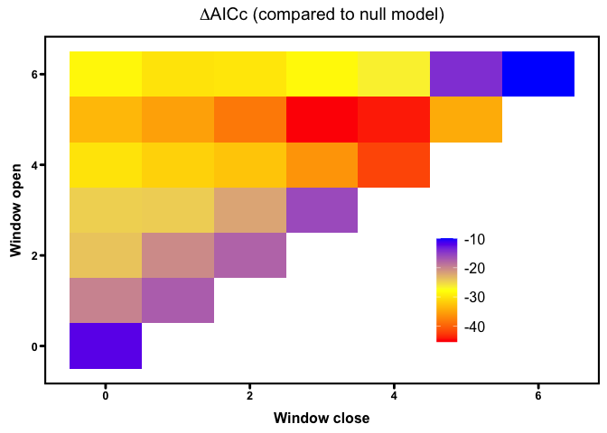

climwin\_demo
================
LRA
2/4/2022

## Demo for Coffee & Code

Use the climwin pacakage to identify climate windows of interest for
further modeling Requires 2 data sets - response variable and climate
data package is structured to use daily climate data Response variable
here is seagrass shoot density

# Prep biological data

    ## # A tibble: 6 x 13
    ## # Groups:   Year, Region, SiteCode, Transect [6]
    ##   SampleDate Region SiteCode TidalHeight Transect TransectPrevale…
    ##   <date>     <chr>  <chr>    <chr>          <dbl>            <dbl>
    ## 1 2019-07-14 AK     A        U                  1             0.45
    ## 2 2019-07-14 AK     A        U                  2             0.4 
    ## 3 2019-07-14 AK     A        U                  3             0.4 
    ## 4 2019-07-14 AK     A        L                  4             1   
    ## 5 2019-07-14 AK     A        L                  5             0.7 
    ## 6 2019-07-14 AK     A        L                  6             0.8 
    ## # … with 7 more variables: TransectLesionArea <dbl>, TransectBladeArea <dbl>,
    ## #   TransectSeverity <dbl>, Year <dbl>, DensityShootsMean <dbl>,
    ## #   CountBlades <dbl>, Meadow <chr>

## Prep climate data

    ## # A tibble: 6 x 19
    ##   time                  lat   lon analysed_sst Meadow Region Site  Date      
    ##   <dttm>              <dbl> <dbl>        <dbl> <chr>  <chr>  <chr> <date>    
    ## 1 2019-01-01 09:00:00  55.5 -133.         7.06 AK_A   AK     A     2019-01-01
    ## 2 2019-01-02 09:00:00  55.5 -133.         7.04 AK_A   AK     A     2019-01-02
    ## 3 2019-01-03 09:00:00  55.5 -133.         7.02 AK_A   AK     A     2019-01-03
    ## 4 2019-01-04 09:00:00  55.5 -133.         6.75 AK_A   AK     A     2019-01-04
    ## 5 2019-01-05 09:00:00  55.5 -133.         6.86 AK_A   AK     A     2019-01-05
    ## 6 2019-01-06 09:00:00  55.5 -133.         6.80 AK_A   AK     A     2019-01-06
    ## # … with 11 more variables: Julian <dbl>, Tmean <dbl>, count <dbl>, T90 <dbl>,
    ## #   Tmean_ma <dbl>, T90_ma <dbl>, DiffMean <dbl>, DiffT90 <dbl>,
    ## #   DiffMeanHeat <dbl>, DiffT90Heat <dbl>, Day <fct>

## Fit baseline model

    ## Linear mixed model fit by REML ['lmerMod']
    ## Formula: DensityShootsMean ~ sBladeArea + TidalHeight + fYear + (1 | Region) +  
    ##     (1 | Meadow)
    ##    Data: dis_env
    ## 
    ## REML criterion at convergence: 5196
    ## 
    ## Scaled residuals: 
    ##     Min      1Q  Median      3Q     Max 
    ## -1.9560 -0.4019 -0.1155  0.2536  8.5274 
    ## 
    ## Random effects:
    ##  Groups   Name        Variance Std.Dev.
    ##  Meadow   (Intercept)  28633   169.2   
    ##  Region   (Intercept)  25955   161.1   
    ##  Residual             102477   320.1   
    ## Number of obs: 362, groups:  Meadow, 21; Region, 5
    ## 
    ## Fixed effects:
    ##              Estimate Std. Error t value
    ## (Intercept)    298.44      89.93   3.319
    ## sBladeArea     -73.38      32.51  -2.257
    ## TidalHeightU    94.31      37.98   2.484
    ## fYear2020      -66.88      41.43  -1.615
    ## fYear2021     -105.55      42.54  -2.481
    ## 
    ## Correlation of Fixed Effects:
    ##             (Intr) sBldAr TdlHgU fY2020
    ## sBladeArea  -0.170                     
    ## TidalHeghtU -0.246  0.458              
    ## fYear2020   -0.220  0.062 -0.001       
    ## fYear2021   -0.258  0.264  0.122  0.477

## Look for climate windows

    ##   |                                                                              |                                                                      |   0%  |                                                                              |||                                                                    |   4%  |                                                                              |||||||||                                                              |  11%  |                                                                              ||||||||||||||||                                                       |  21%  |                                                                              ||||||||||||||||||||||||||                                             |  36%  |                                                                              |||||||||||||||||||||||||||||||||||||||                                |  54%  |                                                                              |||||||||||||||||||||||||||||||||||||||||||||||||||||                  |  75%  |                                                                              |||||||||||||||||||||||||||||||||||||||||||||||||||||||||||||||||||||||| 100%  |                                                                              |                                                                      |   0%  |                                                                              |||                                                                    |   4%  |                                                                              |||||||||                                                              |  11%  |                                                                              ||||||||||||||||                                                       |  21%  |                                                                              ||||||||||||||||||||||||||                                             |  36%  |                                                                              |||||||||||||||||||||||||||||||||||||||                                |  54%  |                                                                              |||||||||||||||||||||||||||||||||||||||||||||||||||||                  |  75%  |                                                                              |||||||||||||||||||||||||||||||||||||||||||||||||||||||||||||||||||||||| 100%  |                                                                              |                                                                      |   0%  |                                                                              |||                                                                    |   4%  |                                                                              |||||||||                                                              |  11%  |                                                                              ||||||||||||||||                                                       |  21%  |                                                                              ||||||||||||||||||||||||||                                             |  36%  |                                                                              |||||||||||||||||||||||||||||||||||||||                                |  54%  |                                                                              |||||||||||||||||||||||||||||||||||||||||||||||||||||                  |  75%  |                                                                              |||||||||||||||||||||||||||||||||||||||||||||||||||||||||||||||||||||||| 100%  |                                                                              |                                                                      |   0%  |                                                                              |||                                                                    |   4%  |                                                                              |||||||||                                                              |  11%  |                                                                              ||||||||||||||||                                                       |  21%  |                                                                              ||||||||||||||||||||||||||                                             |  36%  |                                                                              |||||||||||||||||||||||||||||||||||||||                                |  54%  |                                                                              |||||||||||||||||||||||||||||||||||||||||||||||||||||                  |  75%  |                                                                              |||||||||||||||||||||||||||||||||||||||||||||||||||||||||||||||||||||||| 100%  |                                                                              |                                                                      |   0%  |                                                                              |||                                                                    |   4%  |                                                                              |||||||||                                                              |  11%  |                                                                              ||||||||||||||||                                                       |  21%  |                                                                              ||||||||||||||||||||||||||                                             |  36%  |                                                                              |||||||||||||||||||||||||||||||||||||||                                |  54%  |                                                                              |||||||||||||||||||||||||||||||||||||||||||||||||||||                  |  75%  |                                                                              |||||||||||||||||||||||||||||||||||||||||||||||||||||||||||||||||||||||| 100%  |                                                                              |                                                                      |   0%  |                                                                              |||                                                                    |   4%  |                                                                              |||||||||                                                              |  11%  |                                                                              ||||||||||||||||                                                       |  21%  |                                                                              ||||||||||||||||||||||||||                                             |  36%  |                                                                              |||||||||||||||||||||||||||||||||||||||                                |  54%  |                                                                              |||||||||||||||||||||||||||||||||||||||||||||||||||||                  |  75%  |                                                                              |||||||||||||||||||||||||||||||||||||||||||||||||||||||||||||||||||||||| 100%

    ##            response         climate     type stat func DeltaAICc WindowOpen
    ## 1 DensityShootsMean     TempAnomaly absolute mean  lin    -43.23          6
    ## 2 DensityShootsMean TempAnomalyHeat absolute mean  lin    -45.28          4
    ## 3 DensityShootsMean            Temp absolute mean  lin    -23.22          6
    ## 4 DensityShootsMean     TempAnomaly relative mean  lin    -41.70          5
    ## 5 DensityShootsMean TempAnomalyHeat relative mean  lin    -45.77          5
    ## 6 DensityShootsMean            Temp relative mean  lin    -27.76          5
    ##   WindowClose
    ## 1           6
    ## 2           3
    ## 3           6
    ## 4           4
    ## 5           4
    ## 6           4

<!-- --><!-- -->

## Check for overfitting with randomization

    ##       deltaAICc WindowOpen WindowClose    ModelBeta Std.Error ModelBetaQ
    ## 11   -11.024608          4           4 -129.1761269  32.52657         NA
    ## 16    -9.626538          5           5  -21.6649378  32.54826         NA
    ## 161   -9.682581          5           5  -24.7703063  32.62710         NA
    ## 5     -9.627078          2           1  -81.3874739  32.49572         NA
    ## 22   -11.368989          6           6 -111.6122240  32.43275         NA
    ## 8    -11.998310          3           2  137.1907260  32.53129         NA
    ## 27   -16.400313          6           1 -284.3628681  32.26562         NA
    ## 271  -11.423264          6           1 -161.5176987  32.51642         NA
    ## 7    -17.727001          3           3 -222.7268994  32.27934         NA
    ## 162  -16.036539          5           5 -355.6219434  32.15058         NA
    ## 163  -16.756106          5           5 -368.1862801  32.23840         NA
    ## 164  -11.994487          5           5 -214.2436322  32.49410         NA
    ## 165  -14.162865          5           5  296.0536486  32.40341         NA
    ## 71   -11.254717          3           3 -126.2136766  32.40387         NA
    ## 72   -10.872112          3           3 -117.5547624  32.50578         NA
    ## 166  -12.115915          5           5  222.3012782  32.45048         NA
    ## 167  -12.721094          5           5 -244.4080436  32.34333         NA
    ## 23    -9.946923          6           5   99.4866004  32.52389         NA
    ## 168  -11.750500          5           5 -203.7182147  32.44110         NA
    ## 169   -9.840304          5           5  -67.8728511  32.54490         NA
    ## 1610  -9.610432          5           5  -28.1184107  32.53494         NA
    ## 1611 -10.042308          5           5  -91.5749000  32.51574         NA
    ## 73    -9.970888          3           3  -94.1904897  32.59422         NA
    ## 19   -11.106216          5           2 -145.7828635  32.58111         NA
    ## 25   -11.190063          6           3 -153.7974046  32.44216         NA
    ## 1612  -9.980713          5           5  -85.6868143  32.56816         NA
    ## 1613 -14.853395          5           5  316.0451531  32.36716         NA
    ## 12   -10.477099          4           3  118.3528958  32.49631         NA
    ## 1614 -11.216138          5           5 -175.5509621  32.44624         NA
    ## 272  -10.411596          6           1 -122.3475172  32.67290         NA
    ## 15   -14.320588          4           0 -207.8066682  32.26022         NA
    ## 3    -15.537858          1           0  152.5670022  32.35202         NA
    ## 31   -10.339071          1           0  -88.7519529  32.42153         NA
    ## 1615 -10.414338          5           5 -125.2422516  32.56728         NA
    ## 21    -9.877693          5           0   96.6457381  32.54811         NA
    ## 1616 -13.430597          5           5  268.8283840  32.42352         NA
    ## 74   -12.371813          3           3  146.2170381  32.38002         NA
    ## 231   -9.903165          6           5  -97.7765338  32.51409         NA
    ## 1617  -9.709171          5           5   49.6367965  32.56457         NA
    ## 232  -13.507094          6           5  200.8207073  32.41569         NA
    ## 75   -14.171004          3           3 -176.6069623  32.26337         NA
    ## 4    -10.849760          2           2   88.9105614  32.37570         NA
    ## 121  -10.290782          4           3  112.4193486  32.53130         NA
    ## 1618 -10.925212          5           5  160.3645248  32.44818         NA
    ## 9    -11.467538          3           1 -139.6211733  32.49208         NA
    ## 233  -10.992388          6           5 -137.5796337  32.40659         NA
    ## 1619  -9.724770          5           5  -50.0279882  32.54021         NA
    ## 81   -13.239873          3           2  158.8958899  32.29816         NA
    ## 234  -10.526098          6           5  122.3869620  32.48343         NA
    ## 6    -11.495484          2           0 -132.3977333  32.34512         NA
    ## 111  -10.348978          4           4 -109.9731454  32.47845         NA
    ## 76   -14.600644          3           3 -183.0188637  32.33635         NA
    ## 1620 -11.095539          5           5 -168.8501979  32.50620         NA
    ## 1621 -10.246895          5           5  111.5734853  32.61888         NA
    ## 2    -10.961041          1           1   85.4328076  32.44724         NA
    ## 26   -10.046473          6           2  104.9077639  32.50753         NA
    ## 91   -13.773140          3           1  185.6890433  32.46043         NA
    ## 221  -14.037381          6           6  149.0582510  32.15183         NA
    ## 17   -10.108496          5           4 -108.5477679  32.51625         NA
    ## 10   -12.707859          3           0  168.4753620  32.28241         NA
    ## 235  -11.108826          6           5 -141.2129239  32.44589         NA
    ## 1622 -11.555009          5           5  195.6042199  32.65132         NA
    ## 82   -13.908528          3           2 -167.0333380  32.41404         NA
    ## 171  -12.642570          5           4  205.5821464  32.66131         NA
    ## 13   -24.040003          4           2  320.0316791  31.97132         NA
    ## 1623 -13.399817          5           5  272.0550255  32.40961         NA
    ## 1624 -11.808426          5           5  205.3793504  32.50735         NA
    ## 51   -12.673239          2           1  140.7929302  32.48787         NA
    ## 1625  -9.615387          5           5   -0.4288657  32.54549         NA
    ## 236  -11.292167          6           5 -148.1486040  32.69389         NA
    ## 172  -16.585645          5           4  295.9852654  32.41819         NA
    ## 1    -14.972514          0           0  111.8686962  32.27743         NA
    ## 1626 -13.487856          5           5  274.8489438  32.41443         NA
    ## 1627  -9.772951          5           5   58.2598184  32.61668         NA
    ## 77   -10.914482          3           3 -119.4122838  32.43272         NA
    ## 122  -13.557391          4           3 -196.5305249  32.31382         NA
    ## 1628 -10.523418          5           5 -133.2762683  32.51518         NA
    ## 28   -22.021527          6           0  362.2871448  32.05603         NA
    ## 1629 -11.971323          5           5 -212.6569859  32.42444         NA
    ## 1630  -9.584079          5           5    4.5085589  32.61133         NA
    ## 1631  -9.856501          5           5   68.5334053  32.54665         NA
    ## 14   -11.292589          0           0   82.8661369  32.50521         NA
    ## 24   -12.494068          1           1  102.0148063  32.30580         NA
    ## 173  -19.233216          5           4  344.4244224  32.30181         NA
    ## 237  -12.032829          6           5  167.0048146  32.32672         NA
    ## 78   -14.390035          3           3  180.1865690  32.13807         NA
    ## 92   -15.220856          3           1 -209.5149027  32.30962         NA
    ## 79   -15.375086          3           3 -193.9063446  32.29629         NA
    ## 18   -15.073855          5           3  272.0563457  32.49983         NA
    ## 32   -13.312165          1           0  132.5745989  32.34840         NA
    ## 710  -10.816086          3           3  116.9896247  32.55891         NA
    ## 1632 -10.172595          5           5  105.6035040  32.62245         NA
    ## 52    -9.963597          2           1   89.2262582  32.54803         NA
    ## 711  -16.435421          3           3  210.6733523  32.13102         NA
    ## 1633  -9.828959          5           5   67.5947015  32.57337         NA
    ## 211  -10.273128          5           0 -115.3838117  32.59876         NA
    ## 222  -14.732817          6           6 -162.2647138  32.55230         NA
    ## 1634  -9.877421          5           5  -74.9852264  32.62056         NA
    ## 174  -10.118073          5           4  109.0538744  32.51940         NA
    ## 273  -10.077072          6           1 -107.0175006  32.56487         NA
    ##      ModelBetaC ModelInt Function Furthest Closest Statistics     Type K
    ## 11           NA 321.5455      lin        6       0       mean relative 0
    ## 16           NA 300.7733      lin        6       0       mean relative 0
    ## 161          NA 300.4460      lin        6       0       mean relative 0
    ## 5            NA 324.5824      lin        6       0       mean relative 0
    ## 22           NA 328.3431      lin        6       0       mean relative 0
    ## 8            NA 250.0566      lin        6       0       mean relative 0
    ## 27           NA 378.5374      lin        6       0       mean relative 0
    ## 271          NA 347.9497      lin        6       0       mean relative 0
    ## 7            NA 383.3141      lin        6       0       mean relative 0
    ## 162          NA 343.5627      lin        6       0       mean relative 0
    ## 163          NA 350.0529      lin        6       0       mean relative 0
    ## 164          NA 319.4262      lin        6       0       mean relative 0
    ## 165          NA 265.7058      lin        6       0       mean relative 0
    ## 71           NA 347.1754      lin        6       0       mean relative 0
    ## 72           NA 340.3096      lin        6       0       mean relative 0
    ## 166          NA 273.1979      lin        6       0       mean relative 0
    ## 167          NA 327.8175      lin        6       0       mean relative 0
    ## 23           NA 277.6770      lin        6       0       mean relative 0
    ## 168          NA 323.4643      lin        6       0       mean relative 0
    ## 169          NA 307.1987      lin        6       0       mean relative 0
    ## 1610         NA 301.7320      lin        6       0       mean relative 0
    ## 1611         NA 308.3825      lin        6       0       mean relative 0
    ## 73           NA 333.6311      lin        6       0       mean relative 0
    ## 19           NA 331.4075      lin        6       0       mean relative 0
    ## 25           NA 336.3322      lin        6       0       mean relative 0
    ## 1612         NA 307.8310      lin        6       0       mean relative 0
    ## 1613         NA 261.6442      lin        6       0       mean relative 0
    ## 12           NA 265.2398      lin        6       0       mean relative 0
    ## 1614         NA 318.4485      lin        6       0       mean relative 0
    ## 272          NA 333.9829      lin        6       0       mean relative 0
    ## 15           NA 376.6887      lin        6       0       mean relative 0
    ## 3            NA 219.7166      lin        6       0       mean relative 0
    ## 31           NA 345.8545      lin        6       0       mean relative 0
    ## 1615         NA 313.9362      lin        6       0       mean relative 0
    ## 21           NA 266.7181      lin        6       0       mean relative 0
    ## 1616         NA 265.3708      lin        6       0       mean relative 0
    ## 74           NA 240.2611      lin        6       0       mean relative 0
    ## 231          NA 314.6956      lin        6       0       mean relative 0
    ## 1617         NA 292.4558      lin        6       0       mean relative 0
    ## 232          NA 260.8610      lin        6       0       mean relative 0
    ## 75           NA 373.9969      lin        6       0       mean relative 0
    ## 4            NA 271.7027      lin        6       0       mean relative 0
    ## 121          NA 263.0920      lin        6       0       mean relative 0
    ## 1618         NA 278.6740      lin        6       0       mean relative 0
    ## 9            NA 350.3622      lin        6       0       mean relative 0
    ## 233          NA 326.9546      lin        6       0       mean relative 0
    ## 1619         NA 305.5111      lin        6       0       mean relative 0
    ## 81           NA 250.9387      lin        6       0       mean relative 0
    ## 234          NA 275.5036      lin        6       0       mean relative 0
    ## 6            NA 357.0060      lin        6       0       mean relative 0
    ## 111          NA 317.3328      lin        6       0       mean relative 0
    ## 76           NA 365.3342      lin        6       0       mean relative 0
    ## 1620         NA 321.2315      lin        6       0       mean relative 0
    ## 1621         NA 287.1098      lin        6       0       mean relative 0
    ## 2            NA 255.8641      lin        6       0       mean relative 0
    ## 26           NA 271.5249      lin        6       0       mean relative 0
    ## 91           NA 222.6064      lin        6       0       mean relative 0
    ## 221          NA 262.2665      lin        6       0       mean relative 0
    ## 17           NA 313.5607      lin        6       0       mean relative 0
    ## 10           NA 232.1838      lin        6       0       mean relative 0
    ## 235          NA 330.2991      lin        6       0       mean relative 0
    ## 1622         NA 274.2412      lin        6       0       mean relative 0
    ## 82           NA 350.6580      lin        6       0       mean relative 0
    ## 171          NA 261.3318      lin        6       0       mean relative 0
    ## 13           NA 204.4126      lin        6       0       mean relative 0
    ## 1623         NA 265.9673      lin        6       0       mean relative 0
    ## 1624         NA 274.1282      lin        6       0       mean relative 0
    ## 51           NA 237.9530      lin        6       0       mean relative 0
    ## 1625         NA 298.5445      lin        6       0       mean relative 0
    ## 236          NA 327.9039      lin        6       0       mean relative 0
    ## 172          NA 254.2924      lin        6       0       mean relative 0
    ## 1            NA 223.8143      lin        6       0       mean relative 0
    ## 1626         NA 268.5167      lin        6       0       mean relative 0
    ## 1627         NA 293.6965      lin        6       0       mean relative 0
    ## 77           NA 343.6570      lin        6       0       mean relative 0
    ## 122          NA 354.6478      lin        6       0       mean relative 0
    ## 1628         NA 311.6040      lin        6       0       mean relative 0
    ## 28           NA 175.8517      lin        6       0       mean relative 0
    ## 1629         NA 323.3579      lin        6       0       mean relative 0
    ## 1630         NA 297.9874      lin        6       0       mean relative 0
    ## 1631         NA 289.4053      lin        6       0       mean relative 0
    ## 14           NA 238.9004      lin        6       0       mean relative 0
    ## 24           NA 251.9368      lin        6       0       mean relative 0
    ## 173          NA 247.3320      lin        6       0       mean relative 0
    ## 237          NA 263.5439      lin        6       0       mean relative 0
    ## 78           NA 228.0983      lin        6       0       mean relative 0
    ## 92           NA 380.5840      lin        6       0       mean relative 0
    ## 79           NA 377.1820      lin        6       0       mean relative 0
    ## 18           NA 241.4324      lin        6       0       mean relative 0
    ## 32           NA 225.6280      lin        6       0       mean relative 0
    ## 710          NA 249.8142      lin        6       0       mean relative 0
    ## 1632         NA 287.9023      lin        6       0       mean relative 0
    ## 52           NA 262.0565      lin        6       0       mean relative 0
    ## 711          NA 217.6406      lin        6       0       mean relative 0
    ## 1633         NA 290.0299      lin        6       0       mean relative 0
    ## 211          NA 336.7146      lin        6       0       mean relative 0
    ## 222          NA 347.8206      lin        6       0       mean relative 0
    ## 1634         NA 305.4328      lin        6       0       mean relative 0
    ## 174          NA 282.1634      lin        6       0       mean relative 0
    ## 273          NA 331.1902      lin        6       0       mean relative 0
    ##       ModWeight sample.size Randomised Repeat WeightDist
    ## 11   0.07130636          63        yes      1  0.8571429
    ## 16   0.05565744          63        yes      2  0.8928571
    ## 161  0.05409723          63        yes      3  0.8928571
    ## 5    0.05177359          63        yes      4  0.8928571
    ## 22   0.09635609          63        yes      5  0.8928571
    ## 8    0.11342832          63        yes      6  0.8571429
    ## 27   0.11128775          63        yes      7  0.6785714
    ## 271  0.07103829          63        yes      8  0.8571429
    ## 7    0.31424684          63        yes      9  0.6428571
    ## 162  0.49556950          63        yes     10  0.7857143
    ## 163  0.21888612          63        yes     11  0.5714286
    ## 164  0.13133110          63        yes     12  0.8571429
    ## 165  0.29304935          63        yes     13  0.8214286
    ## 71   0.08944475          63        yes     14  0.8571429
    ## 72   0.09034106          63        yes     15  0.8928571
    ## 166  0.13364447          63        yes     16  0.8571429
    ## 167  0.16235112          63        yes     17  0.8214286
    ## 23   0.05327772          63        yes     18  0.8928571
    ## 168  0.10695441          63        yes     19  0.8571429
    ## 169  0.06295921          63        yes     20  0.8928571
    ## 1610 0.05189097          63        yes     21  0.8928571
    ## 1611 0.06635543          63        yes     22  0.8928571
    ## 73   0.06111790          63        yes     23  0.8928571
    ## 19   0.07751030          63        yes     24  0.8571429
    ## 25   0.07387391          63        yes     25  0.8571429
    ## 1612 0.06143088          63        yes     26  0.8928571
    ## 1613 0.22875630          63        yes     27  0.7857143
    ## 12   0.07078922          63        yes     28  0.8571429
    ## 1614 0.09738425          63        yes     29  0.8571429
    ## 272  0.05834267          63        yes     30  0.8571429
    ## 15   0.12358783          63        yes     31  0.7857143
    ## 3    0.30426025          63        yes     32  0.7857143
    ## 31   0.06632151          63        yes     33  0.8928571
    ## 1615 0.07999587          63        yes     34  0.8928571
    ## 21   0.05287478          63        yes     35  0.8928571
    ## 1616 0.17765072          63        yes     36  0.8571429
    ## 74   0.13682636          63        yes     37  0.8571429
    ## 231  0.05704177          63        yes     38  0.8928571
    ## 1617 0.05638662          63        yes     39  0.8928571
    ## 232  0.17345855          63        yes     40  0.7857143
    ## 75   0.12151239          63        yes     41  0.7857143
    ## 4    0.08815270          63        yes     42  0.8928571
    ## 121  0.05564114          63        yes     43  0.8571429
    ## 1618 0.08643583          63        yes     44  0.8571429
    ## 9    0.07507644          63        yes     45  0.8571429
    ## 233  0.09259135          63        yes     46  0.8928571
    ## 1619 0.05773300          63        yes     47  0.8928571
    ## 81   0.18534160          63        yes     48  0.8214286
    ## 234  0.06533505          63        yes     49  0.8928571
    ## 6    0.08476732          63        yes     50  0.8571429
    ## 111  0.06529600          63        yes     51  0.8928571
    ## 76   0.27607408          63        yes     52  0.8214286
    ## 1620 0.10942022          63        yes     53  0.8928571
    ## 1621 0.06424649          63        yes     54  0.8928571
    ## 2    0.09162228          63        yes     55  0.8928571
    ## 26   0.05676190          63        yes     56  0.8928571
    ## 91   0.09582836          63        yes     57  0.7500000
    ## 221  0.27483745          63        yes     58  0.8214286
    ## 17   0.06569360          63        yes     59  0.8928571
    ## 10   0.09920797          63        yes     60  0.8214286
    ## 235  0.09184850          63        yes     61  0.8928571
    ## 1622 0.11369246          63        yes     62  0.8928571
    ## 82   0.15792145          63        yes     63  0.8214286
    ## 171  0.08226004          63        yes     64  0.7857143
    ## 13   0.15352508          63        yes     65  0.4642857
    ## 1623 0.11688065          63        yes     66  0.7857143
    ## 1624 0.13461940          63        yes     67  0.8928571
    ## 51   0.10906669          63        yes     68  0.8214286
    ## 1625 0.05481152          63        yes     69  0.8928571
    ## 236  0.09747651          63        yes     70  0.8571429
    ## 172  0.31439875          63        yes     71  0.6428571
    ## 1    0.28170972          63        yes     72  0.7857143
    ## 1626 0.10932251          63        yes     73  0.7857143
    ## 1627 0.05570035          63        yes     74  0.8928571
    ## 77   0.06965545          63        yes     75  0.8571429
    ## 122  0.13749938          63        yes     76  0.7857143
    ## 1628 0.07852398          63        yes     77  0.8928571
    ## 28   0.19053719          63        yes     78  0.5357143
    ## 1629 0.11656179          63        yes     79  0.8571429
    ## 1630 0.05304609          63        yes     80  0.8928571
    ## 1631 0.05845104          63        yes     81  0.8928571
    ## 14   0.08288690          63        yes     82  0.8928571
    ## 24   0.11070020          63        yes     83  0.8571429
    ## 173  0.34253339          63        yes     84  0.5000000
    ## 237  0.12225459          63        yes     85  0.8571429
    ## 78   0.22874400          63        yes     86  0.7857143
    ## 92   0.18339618          63        yes     87  0.7500000
    ## 79   0.21536234          63        yes     88  0.7500000
    ## 18   0.16665555          63        yes     89  0.7142857
    ## 32   0.16424723          63        yes     90  0.8214286
    ## 710  0.08490111          63        yes     91  0.8928571
    ## 1632 0.07219323          63        yes     92  0.8928571
    ## 52   0.05308997          63        yes     93  0.8571429
    ## 711  0.16054764          63        yes     94  0.6785714
    ## 1633 0.05414321          63        yes     95  0.8928571
    ## 211  0.05613506          63        yes     96  0.8571429
    ## 222  0.30504583          63        yes     97  0.7857143
    ## 1634 0.05901473          63        yes     98  0.8928571
    ## 174  0.05785678          63        yes     99  0.8928571
    ## 273  0.05399610          63        yes    100  0.8571429

<!-- -->

    ## [1] "<0.001"

## Update baseline model to include climate

    ##   yvar  sBladeArea TidalHeight fYear Region Meadow   climate
    ## 1  520 -1.10021478           U  2019     AK   AK_A 0.4785788
    ## 2  733 -1.00713811           U  2019     AK   AK_A 0.4785788
    ## 3  753 -1.09155573           U  2019     AK   AK_A 0.4785788
    ## 4  900 -0.41868154           L  2019     AK   AK_A 0.4785788
    ## 5  542 -0.05656529           L  2019     AK   AK_A 0.4785788
    ## 6  545 -0.75170890           L  2019     AK   AK_A 0.4785788

    ## Linear mixed model fit by REML ['lmerMod']
    ## Formula: 
    ## DensityShootsMean ~ sBladeArea + TidalHeight + fYear + TempAnomalyHeat +  
    ##     (1 | Region) + (1 | Meadow)
    ##    Data: new_data
    ## 
    ## REML criterion at convergence: 5148.1
    ## 
    ## Scaled residuals: 
    ##     Min      1Q  Median      3Q     Max 
    ## -1.9116 -0.4508 -0.0778  0.3365  8.4671 
    ## 
    ## Random effects:
    ##  Groups   Name        Variance Std.Dev.
    ##  Meadow   (Intercept) 26327    162.3   
    ##  Region   (Intercept) 20720    143.9   
    ##  Residual             92991    304.9   
    ## Number of obs: 362, groups:  Meadow, 21; Region, 5
    ## 
    ## Fixed effects:
    ##                 Estimate Std. Error t value
    ## (Intercept)        3.611     95.394   0.038
    ## sBladeArea       -36.065     31.483  -1.146
    ## TidalHeightU     119.211     36.381   3.277
    ## fYear2020         76.994     45.907   1.677
    ## fYear2021        178.865     61.605   2.903
    ## TempAnomalyHeat  997.928    162.677   6.134
    ## 
    ## Correlation of Fixed Effects:
    ##             (Intr) sBldAr TdlHgU fY2020 fY2021
    ## sBladeArea  -0.249                            
    ## TidalHeghtU -0.277  0.467                     
    ## fYear2020   -0.428  0.153  0.057              
    ## fYear2021   -0.533  0.319  0.165  0.654       
    ## TempAnmlyHt -0.505  0.198  0.114  0.511  0.753

    ##                df      AIC
    ## fit_den         8 5212.000
    ## fit_den_update  9 5166.126
